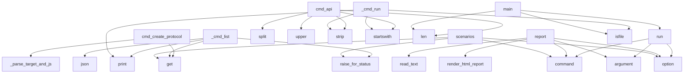

# System Architecture Analysis

## Overview

- **Project**: /home/tom/github/oqlos/oql
- **Primary Language**: python
- **Languages**: python: 16, shell: 2
- **Analysis Mode**: static
- **Total Functions**: 63
- **Total Classes**: 9
- **Modules**: 18
- **Entry Points**: 57

## Architecture by Module

### oql.cli
- **Functions**: 11
- **File**: `cli.py`

### oql.shell.commands
- **Functions**: 11
- **Classes**: 1
- **File**: `commands.py`

### oql.shell.executor
- **Functions**: 8
- **Classes**: 1
- **File**: `executor.py`

### oql.shell.process_commands
- **Functions**: 7
- **Classes**: 1
- **File**: `process_commands.py`

### oql.shell.protocol_commands
- **Functions**: 6
- **Classes**: 1
- **File**: `protocol_commands.py`

### oql.shell.session_commands
- **Functions**: 5
- **Classes**: 1
- **File**: `session_commands.py`

### oql.shell.runner
- **Functions**: 4
- **File**: `runner.py`

### oql.adapters.remote
- **Functions**: 4
- **Classes**: 1
- **File**: `remote.py`

### oql.shell.ui_commands
- **Functions**: 3
- **Classes**: 1
- **File**: `ui_commands.py`

### oql.adapters.local
- **Functions**: 2
- **Classes**: 1
- **File**: `local.py`

### oql.shell.api_commands
- **Functions**: 2
- **Classes**: 1
- **File**: `api_commands.py`

## Key Entry Points

Main execution flows into the system:

### oql.shell.api_commands.ApiCommandsMixin.cmd_create_protocol
> CREATE_PROTOCOL "name" {...} - Create protocol via API
- **Calls**: self._parse_target_and_json, data.get, data.get, data.get, data.get, urllib.request.Request, None.isoformat, urllib.request.urlopen

### oql.cli.run
> Run an OQL scenario file.
- **Calls**: main.command, click.argument, click.option, click.option, click.option, click.option, click.option, None.read_text

### oql.shell.commands._cmd_list
> List peripherals - filter by pattern like 'pompa*' or 'pump*'
- **Calls**: httpx.get, resp.raise_for_status, resp.json, data.get, print, None.lower, p.get, p.get

### oql.shell.api_commands.ApiCommandsMixin.cmd_api
> API GET|POST|PUT|DELETE "url" {...} 
- **Calls**: None.split, None.upper, None.strip, url.startswith, len, print, None.startswith, urllib.request.Request

### oql.cli.report
> Generate HTML report from data.json.

Pipeline: data.json → raport.html
- **Calls**: main.command, click.argument, click.option, None.read_text, render_html_report, None.write_text, click.echo, click.echo

### oql.cli.scenarios
> List available scenarios.
- **Calls**: main.command, click.option, httpx.get, resp.raise_for_status, None.get, click.echo, click.echo, sys.exit

### oql.shell.commands._cmd_run
- **Calls**: args.strip, None.startswith, os.path.isfile, print, print, print, print, script_path.upper

### oql.shell.runner.main
- **Calls**: len, asyncio.run, asyncio.run, os.path.isfile, oql.shell.runner.run_shell, len, oql.shell.runner.run_command, asyncio.run

### oql.shell.executor.DslExecutor._parse_target_and_json
> Parse 'target' {...} format
- **Calls**: args.strip, args.startswith, rest.startswith, args.find, args.startswith, None.strip, args.find, args.split

### oql.shell.executor.DslExecutor.execute
> Execute a single DSL command via registry dispatch.
- **Calls**: command.strip, command.split, None.upper, self.COMMAND_REGISTRY.get, print, command.startswith, action.lower, getattr

### oql.cli.validate
> Validate an OQL scenario file (parse only).
- **Calls**: main.command, click.argument, None.read_text, CqlInterpreter, interp.run, sys.exit, click.Path, Path

### oql.cli.hardware
> List connected hardware peripherals.
- **Calls**: main.command, click.option, httpx.get, resp.raise_for_status, print, json.dumps, click.echo, sys.exit

### oql.cli.shell_cmd
> Start interactive OQL shell.
- **Calls**: main.command, click.echo, LocalAdapter, adapter.execute, None.strip, line.lower, click.echo, input

### oql.shell.commands._cmd_scripts
- **Calls**: examples_dir.exists, print, sorted, examples_dir.glob, print, Path, f.relative_to, Path

### oql.shell.executor.DslExecutor.emit_event
> Emit event (store + broadcast)
- **Calls**: self.event_store.append, self._generate_id, None.replace, self.session_events.append, None.isoformat, self.websocket.send, json.dumps, datetime.now

### oql.cli.cmd
> Execute a single OQL command line.
- **Calls**: main.command, click.argument, click.option, click.option, sys.exit, oql.cli._execute_single_command, click.Choice

### oql.shell.session_commands.SessionCommandsMixin.cmd_record_start
> RECORD_START ["user-id"] 
- **Calls**: self._generate_id, print, args.strip, None.strip, self.emit_event, args.strip

### oql.shell.commands.ShellCommandRegistry.get_handler
> Get handler for a command line. Returns (handler, args) or (None, line).
- **Calls**: line.split, None.lower, self.aliases.get, self.handlers.get, len

### oql.shell.executor.DslExecutor.execute_script
> Execute multiple commands
- **Calls**: None.split, line.strip, script.strip, line.startswith, self.execute

### oql.shell.protocol_commands.ProtocolCommandsMixin.cmd_step_complete
> STEP_COMPLETE "step-id" {...} 
- **Calls**: self._parse_target_and_json, None.get, print, self.emit_event

### oql.shell.process_commands.ProcessCommandsMixin.cmd_layout
> LAYOUT "layout-name" 
- **Calls**: None.strip, print, self.emit_event, args.strip

### oql.shell.process_commands.ProcessCommandsMixin.cmd_state_save
> STATE_SAVE "name" 
- **Calls**: None.strip, print, self.emit_event, args.strip

### oql.shell.process_commands.ProcessCommandsMixin.cmd_state_restore
> STATE_RESTORE "name" 
- **Calls**: None.strip, print, self.emit_event, args.strip

### oql.shell.process_commands.ProcessCommandsMixin.cmd_process_next
> PROCESS_NEXT {...} 
- **Calls**: print, self.emit_event, args.strip, json.loads

### oql.shell.ui_commands.UiCommandsMixin.cmd_navigate
> NAVIGATE "/route" 
- **Calls**: None.strip, print, self.emit_event, args.strip

### oql.shell.ui_commands.UiCommandsMixin.cmd_input
> INPUT "#selector" {"value": "..."} 
- **Calls**: self._parse_target_and_json, print, self.emit_event, None.get

### oql.shell.session_commands.SessionCommandsMixin.cmd_record_stop
> RECORD_STOP 
- **Calls**: print, self.emit_event, len, len

### oql.shell.session_commands.SessionCommandsMixin.cmd_wait
> WAIT <ms> 
- **Calls**: int, print, args.strip, asyncio.sleep

### oql.shell.session_commands.SessionCommandsMixin.cmd_log
> LOG "message" {...} 
- **Calls**: self._parse_target_and_json, None.get, print, icons.get

### oql.adapters.remote.RemoteAdapter.list_scenarios
- **Calls**: httpx.get, resp.raise_for_status, None.get, resp.json

## Process Flows

Key execution flows identified:

### Flow 1: cmd_create_protocol
```
cmd_create_protocol [oql.shell.api_commands.ApiCommandsMixin]
```

### Flow 2: run
```
run [oql.cli]
```

### Flow 3: _cmd_list
```
_cmd_list [oql.shell.commands]
```

### Flow 4: cmd_api
```
cmd_api [oql.shell.api_commands.ApiCommandsMixin]
```

### Flow 5: report
```
report [oql.cli]
```

### Flow 6: scenarios
```
scenarios [oql.cli]
```

### Flow 7: _cmd_run
```
_cmd_run [oql.shell.commands]
```

### Flow 8: main
```
main [oql.shell.runner]
  └─> run_shell
```

### Flow 9: _parse_target_and_json
```
_parse_target_and_json [oql.shell.executor.DslExecutor]
```

### Flow 10: execute
```
execute [oql.shell.executor.DslExecutor]
```

## Key Classes

### oql.shell.executor.DslExecutor
> Execute DSL commands
- **Methods**: 8
- **Key Methods**: oql.shell.executor.DslExecutor.__init__, oql.shell.executor.DslExecutor.connect_websocket, oql.shell.executor.DslExecutor.disconnect_websocket, oql.shell.executor.DslExecutor.emit_event, oql.shell.executor.DslExecutor.execute, oql.shell.executor.DslExecutor.execute_script, oql.shell.executor.DslExecutor._parse_target_and_json, oql.shell.executor.DslExecutor._generate_id
- **Inherits**: ApiCommandsMixin, UiCommandsMixin, ProtocolCommandsMixin, ProcessCommandsMixin, SessionCommandsMixin

### oql.shell.process_commands.ProcessCommandsMixin
> Commands for process flow, components, state, and events.
- **Methods**: 7
- **Key Methods**: oql.shell.process_commands.ProcessCommandsMixin.cmd_emit, oql.shell.process_commands.ProcessCommandsMixin.cmd_render, oql.shell.process_commands.ProcessCommandsMixin.cmd_layout, oql.shell.process_commands.ProcessCommandsMixin.cmd_state_save, oql.shell.process_commands.ProcessCommandsMixin.cmd_state_restore, oql.shell.process_commands.ProcessCommandsMixin.cmd_process_start, oql.shell.process_commands.ProcessCommandsMixin.cmd_process_next

### oql.shell.protocol_commands.ProtocolCommandsMixin
> Commands for test flow and protocol management.
- **Methods**: 6
- **Key Methods**: oql.shell.protocol_commands.ProtocolCommandsMixin.cmd_select_device, oql.shell.protocol_commands.ProtocolCommandsMixin.cmd_select_interval, oql.shell.protocol_commands.ProtocolCommandsMixin.cmd_start_test, oql.shell.protocol_commands.ProtocolCommandsMixin.cmd_step_complete, oql.shell.protocol_commands.ProtocolCommandsMixin.cmd_protocol_created, oql.shell.protocol_commands.ProtocolCommandsMixin.cmd_protocol_finalize

### oql.shell.session_commands.SessionCommandsMixin
> Commands for recording sessions, waiting, logging, and help.
- **Methods**: 5
- **Key Methods**: oql.shell.session_commands.SessionCommandsMixin.cmd_record_start, oql.shell.session_commands.SessionCommandsMixin.cmd_record_stop, oql.shell.session_commands.SessionCommandsMixin.cmd_wait, oql.shell.session_commands.SessionCommandsMixin.cmd_log, oql.shell.session_commands.SessionCommandsMixin.cmd_help

### oql.adapters.remote.RemoteAdapter
> Execute OQL commands via OqlOS REST API.
- **Methods**: 4
- **Key Methods**: oql.adapters.remote.RemoteAdapter.__init__, oql.adapters.remote.RemoteAdapter.execute, oql.adapters.remote.RemoteAdapter.list_scenarios, oql.adapters.remote.RemoteAdapter.list_hardware

### oql.shell.commands.ShellCommandRegistry
> Registry for interactive shell commands.
- **Methods**: 3
- **Key Methods**: oql.shell.commands.ShellCommandRegistry.__init__, oql.shell.commands.ShellCommandRegistry.register, oql.shell.commands.ShellCommandRegistry.get_handler

### oql.shell.ui_commands.UiCommandsMixin
> Commands for browser UI interaction.
- **Methods**: 3
- **Key Methods**: oql.shell.ui_commands.UiCommandsMixin.cmd_navigate, oql.shell.ui_commands.UiCommandsMixin.cmd_click, oql.shell.ui_commands.UiCommandsMixin.cmd_input

### oql.adapters.local.LocalAdapter
> Execute OQL commands directly via oqlos library.
- **Methods**: 2
- **Key Methods**: oql.adapters.local.LocalAdapter.__init__, oql.adapters.local.LocalAdapter.execute

### oql.shell.api_commands.ApiCommandsMixin
> Commands that make HTTP calls to the backend API.
- **Methods**: 2
- **Key Methods**: oql.shell.api_commands.ApiCommandsMixin.cmd_api, oql.shell.api_commands.ApiCommandsMixin.cmd_create_protocol

## Data Transformation Functions

Key functions that process and transform data:

### oql.shell.process_commands.ProcessCommandsMixin.cmd_process_start
> PROCESS_START "process-id" {...} 
- **Output to**: self._parse_target_and_json, print, self.emit_event

### oql.shell.process_commands.ProcessCommandsMixin.cmd_process_next
> PROCESS_NEXT {...} 
- **Output to**: print, self.emit_event, args.strip, json.loads

### oql.cli.validate
> Validate an OQL scenario file (parse only).
- **Output to**: main.command, click.argument, None.read_text, CqlInterpreter, interp.run

### oql.shell.executor.DslExecutor._parse_target_and_json
> Parse 'target' {...} format
- **Output to**: args.strip, args.startswith, rest.startswith, args.find, args.startswith

## Behavioral Patterns

### state_machine_ProcessCommandsMixin
- **Type**: state_machine
- **Confidence**: 0.70
- **Functions**: oql.shell.process_commands.ProcessCommandsMixin.cmd_emit, oql.shell.process_commands.ProcessCommandsMixin.cmd_render, oql.shell.process_commands.ProcessCommandsMixin.cmd_layout, oql.shell.process_commands.ProcessCommandsMixin.cmd_state_save, oql.shell.process_commands.ProcessCommandsMixin.cmd_state_restore

### state_machine_DslExecutor
- **Type**: state_machine
- **Confidence**: 0.70
- **Functions**: oql.shell.executor.DslExecutor.__init__, oql.shell.executor.DslExecutor.connect_websocket, oql.shell.executor.DslExecutor.disconnect_websocket, oql.shell.executor.DslExecutor.emit_event, oql.shell.executor.DslExecutor.execute

## Public API Surface

Functions exposed as public API (no underscore prefix):

- `oql.shell.api_commands.ApiCommandsMixin.cmd_create_protocol` - 23 calls
- `oql.cli.run` - 22 calls
- `oql.shell.api_commands.ApiCommandsMixin.cmd_api` - 21 calls
- `oql.cli.report` - 12 calls
- `oql.cli.scenarios` - 11 calls
- `oql.shell.runner.main` - 11 calls
- `oql.shell.runner.run_shell` - 10 calls
- `oql.shell.executor.DslExecutor.execute` - 10 calls
- `oql.cli.validate` - 9 calls
- `oql.cli.hardware` - 9 calls
- `oql.cli.shell_cmd` - 8 calls
- `oql.shell.runner.run_script` - 8 calls
- `oql.shell.executor.DslExecutor.emit_event` - 8 calls
- `oql.cli.cmd` - 7 calls
- `oql.shell.session_commands.SessionCommandsMixin.cmd_record_start` - 6 calls
- `oql.shell.commands.ShellCommandRegistry.get_handler` - 5 calls
- `oql.shell.executor.DslExecutor.execute_script` - 5 calls
- `oql.shell.protocol_commands.ProtocolCommandsMixin.cmd_step_complete` - 4 calls
- `oql.shell.process_commands.ProcessCommandsMixin.cmd_layout` - 4 calls
- `oql.shell.process_commands.ProcessCommandsMixin.cmd_state_save` - 4 calls
- `oql.shell.process_commands.ProcessCommandsMixin.cmd_state_restore` - 4 calls
- `oql.shell.process_commands.ProcessCommandsMixin.cmd_process_next` - 4 calls
- `oql.shell.runner.run_command` - 4 calls
- `oql.shell.ui_commands.UiCommandsMixin.cmd_navigate` - 4 calls
- `oql.shell.ui_commands.UiCommandsMixin.cmd_input` - 4 calls
- `oql.shell.session_commands.SessionCommandsMixin.cmd_record_stop` - 4 calls
- `oql.shell.session_commands.SessionCommandsMixin.cmd_wait` - 4 calls
- `oql.shell.session_commands.SessionCommandsMixin.cmd_log` - 4 calls
- `oql.adapters.remote.RemoteAdapter.list_scenarios` - 4 calls
- `oql.adapters.remote.RemoteAdapter.list_hardware` - 4 calls
- `oql.shell.protocol_commands.ProtocolCommandsMixin.cmd_select_device` - 3 calls
- `oql.shell.protocol_commands.ProtocolCommandsMixin.cmd_select_interval` - 3 calls
- `oql.shell.protocol_commands.ProtocolCommandsMixin.cmd_start_test` - 3 calls
- `oql.shell.protocol_commands.ProtocolCommandsMixin.cmd_protocol_created` - 3 calls
- `oql.shell.protocol_commands.ProtocolCommandsMixin.cmd_protocol_finalize` - 3 calls
- `oql.shell.process_commands.ProcessCommandsMixin.cmd_emit` - 3 calls
- `oql.shell.process_commands.ProcessCommandsMixin.cmd_render` - 3 calls
- `oql.shell.process_commands.ProcessCommandsMixin.cmd_process_start` - 3 calls
- `oql.shell.ui_commands.UiCommandsMixin.cmd_click` - 3 calls
- `oql.adapters.remote.RemoteAdapter.execute` - 3 calls

## System Interactions

How components interact:



## Reverse Engineering Guidelines

1. **Entry Points**: Start analysis from the entry points listed above
2. **Core Logic**: Focus on classes with many methods
3. **Data Flow**: Follow data transformation functions
4. **Process Flows**: Use the flow diagrams for execution paths
5. **API Surface**: Public API functions reveal the interface

## Context for LLM

Maintain the identified architectural patterns and public API surface when suggesting changes.